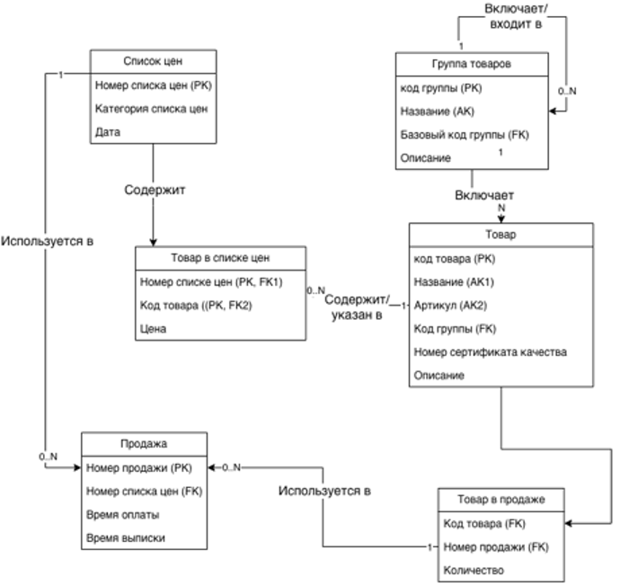

# Trade APP

Учебный проект, показывающий возможности взаимодействия web приложения и БД PostgreSQL с использованием ORM Sequelize.
Проект предполагает определение Бд из 6 таблиц.



# Инструкции по установке
В вашем файле README должны быть четкие инструкции по установке. Если у проекта есть какие-либо зависимости, обязательно укажите их в шагах. Фрагмент кода, демонстрирующий команды установки, может быть очень полезен.

```
npm install your-package
```

# Использование
Покажите примеры использования вашего проекта. Пользователь должен понимать, как реализовать ваш проект с минимальными усилиями. Включите фрагменты кода или скриншоты для иллюстрации.

```
const yourPackage = require('your-package');
yourPackage.doSomething();
```

# Вклад
Если ваш проект является проектом с открытым исходным кодом и вы хотите побудить других к участию, включите раздел о том, как можно внести свой вклад. Укажите им на необходимые ресурсы и процессы.

# Документация
Если ваш проект имеет дополнительную документацию, предоставьте ссылки на эти ресурсы.

# Лицензия 
Включите раздел, посвященный лицензии вашего проекта. Это информирует пользователей об их законных правах и ограничениях при использовании вашего программного обеспечения.

# Контактная информация
Укажите контактные данные или способы поддержки проекта в случае возникновения вопросов или проблем.

# Благодарности 
Если ваш проект использует код из других проектов с открытым исходным кодом, профессионально будет указать источник и отдать должное.

